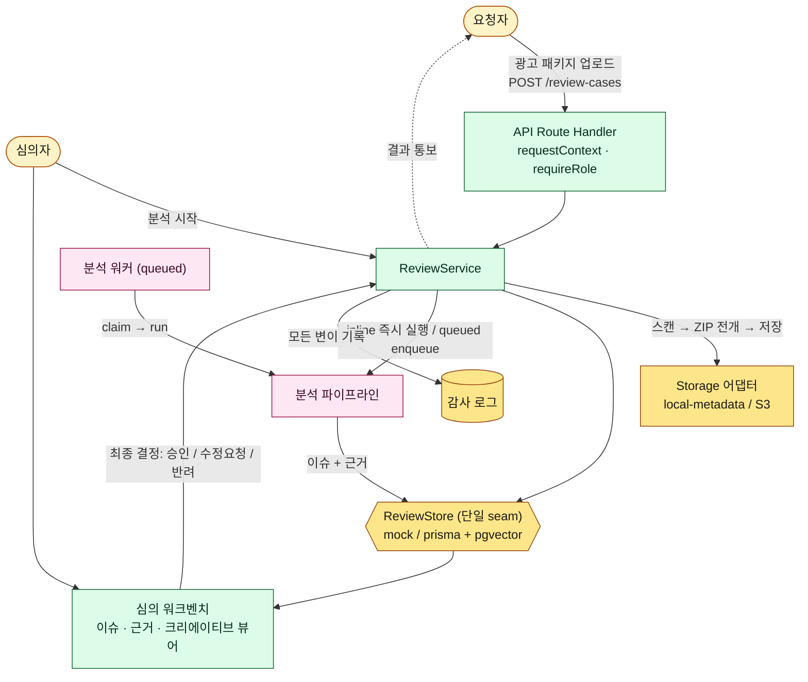

<div align="center">
  

  <h1>FinProof Agent</h1>
  <p><b>근거 기반 금융 광고 심의 AI 에이전트</b></p>
  <p>업로드된 광고 패키지를 OCR·RAG로 분석하고, 규정 근거와 함께 위반 사항을 제시하여<br/>심의자가 <i>승인 / 수정요청 / 반려</i>를 빠르고 일관되게 결정하도록 돕습니다.</p>

  <sub>Next.js 16 · React 19 · TypeScript · PostgreSQL + pgvector · Prisma · OpenAI / Gemini</sub>
</div>

---

## 1. 무엇을, 왜 푸는가

금융 광고는 자본시장법·표시광고법 등 규제를 위반하면 제재로 이어집니다. 그러나 실제 심의는
**사람이 수십 페이지의 광고물과 규정·내부 지침을 대조**하는 수작업이라 느리고, 심의자마다
판단 편차가 큽니다.

**FinProof는 이 심의 과정을 근거 기반으로 자동화합니다.**

- 광고 패키지(이미지·카피·약관 ZIP)를 업로드하면
- OCR로 텍스트를 추출하고, 승인된 지식 문서(법령·내부 지침·과거 심의 사례)에서 **관련 근거를 검색(RAG)** 한 뒤
- 도메인별 서브 에이전트가 위반 가능성을 찾아내고, **근거 인용과 위험도(info~high)·권고 조치**를 단 이슈를 생성합니다
- 심의자는 워크벤치에서 이슈·근거를 확인하고 최종 결정을 내립니다

판정은 항상 **인용 가능한 근거(Evidence)** 에 묶여 있어, "왜 이 결정인가"를 설명할 수 있습니다.

---

## 2. 핵심 기능

| 영역 | 설명 |
|---|---|
| 📥 **광고 패키지 인테이크** | 멀티파트 ZIP 업로드 → 경로 traversal 보호 하에 개별 파일로 전개, 선택적 악성코드 스캔 게이트 |
| 🔍 **근거 검색 (RAG)** | 승인된 지식 문서를 임베딩하여 pgvector로 검색, 선택적 재랭킹. **승인된 문서만** 검색 대상 |
| 🤖 **서브 에이전트 분석** | 도메인별 컴플라이언스 체크를 분담하고, 컴플라이언스 리드가 findings를 이슈로 종합 |
| 🌏 **다국어 위험 분석** | `ko / en / vi / my / km` 언어 감지 후 표현·규정 수준 위험을 언어 세그먼트별로 분석 |
| 🧑‍⚖️ **심의 워크벤치** | 이슈·근거·크리에이티브 뷰어, 재검토 버전 비교, 심의필 발급(워터마크 PDF) |
| 🔐 **RBAC + 감사 로그** | `requester / reviewer / compliance_admin` 3역할, 모든 저장소 호출에 감사 이벤트 기록 |
| 📊 **오프라인 평가 하니스** | 판정 품질을 정량 채점하는 독립 Python 패키지 ([`finproof-eval/`](finproof-eval/)) |

---

## 3. 아키텍처

코드는 `src/` 아래 **3계층**으로 엄격히 분리됩니다.

```
src/
├── app/      ← Next.js App Router: UI 라우트 + HTTP API (api/v1/**)  ※ 핸들러는 얇게 유지
├── domain/   ← 프레임워크 무관 순수 타입·로직 (클라이언트·서버 양쪽에서 import 가능)
└── server/   ← 모든 부수효과 코드 (DB, 분석 파이프라인, 스토리지, 인증) — 서버에서만 import
```

핵심 설계는 **`ReviewStore` 추상화**입니다. UI/API와 영속성 사이의 단일 seam으로,
구현이 두 개입니다.

- `mock-review-store` — 인메모리. 결정론적 데모 경로 (기본값)
- `prisma-review-store` — PostgreSQL + pgvector

환경변수 하나(`FINPROOF_REVIEW_STORE`)로 전환되며, 모든 호출은 `ReviewStoreScope`
(tenant·actor·role)를 받아 RBAC·감사를 일관되게 처리합니다.



<div align="center"><sub>전체 에이전트 플로우 — 인테이크부터 심의 결정까지. 모든 영속성은 <code>ReviewStore</code> seam을 통과합니다.</sub></div>

---

## 4. 분석 파이프라인

`src/server/analysis/review-analysis-pipeline.ts`가 다음 단계를 오케스트레이션합니다.
각 단계는 환경변수로 교체 가능한 **pluggable provider**입니다.

```
OCR → 임베딩 → RAG 검색 → (선택) 재랭킹 → 서브 에이전트 findings → 이슈 생성
```

| 단계 | 로컬(기본) | 프로덕션 |
|---|---|---|
| OCR | `deterministic` | `gemini` / `http` |
| 임베딩 | `deterministic` | `openai` |
| RAG | `deterministic` | `postgres` (pgvector) |
| 재랭킹 | `deterministic` | `cohere` |
| 모델 라우터 | `deterministic` | `router` (OpenAI 텍스트 + Gemini 멀티모달) |

실행 모드도 분리됩니다 — `inline`(요청 내 동기 실행) 또는 `queued`(워커가 큐에서 작업을
claim해 처리, 프로덕션에서는 별도 systemd 유닛).

```mermaid
flowchart LR
    DOC["업로드 문서"] --> OCR["OCR<br/>deterministic · gemini · http"]
    OCR --> EMB["임베딩<br/>deterministic · openai"]
    EMB --> RAG["RAG 검색<br/>승인 지식 + 과거 사례 · pgvector"]
    RAG --> RR["재랭킹 (선택)<br/>cohere"]
    RR --> SUB

    subgraph SUB["서브 에이전트 · 도메인 체크 분담"]
        direction TB
        A1["creative_review"]
        A2["product_terms"]
        A3["regulation"]
        A4["internal_policy"]
        A5["evidence_verification"]
        A6["case_search"]
    end

    SUB -->|"AgentFinding"| LEAD["컴플라이언스 리드<br/>중복·충돌 해소 + 최종 위험도"]
    LEAD --> ISS["이슈 생성<br/>ReviewIssue + Evidence 인용"]

    ROUTER["모델 라우터<br/>default · escalation · multimodal 티어"] -.->|"text / multimodal"| SUB
    ROUTER -.-> LEAD

    classDef stage fill:#dbeafe,stroke:#1e40af,color:#0f172a;
    classDef agent fill:#fce7f3,stroke:#9d174d,color:#3f0a25;
    classDef out fill:#dcfce7,stroke:#166534,color:#052e16;
    class DOC,OCR,EMB,RAG,RR,ROUTER stage;
    class A1,A2,A3,A4,A5,A6 agent;
    class LEAD,ISS out;
```



<div align="center"><sub>서브 에이전트 오케스트레이션 — 도메인 체크를 분담하고 리드가 종합해 근거 기반 이슈를 생성합니다.</sub></div>

---

## 5. 기술 스택

- **프론트엔드** — Next.js 16 (App Router, Turbopack), React 19, TypeScript, CSS Modules
- **백엔드** — Next Route Handlers, 도메인 주도 3계층 분리
- **데이터** — PostgreSQL 17 + pgvector, Prisma (생성 클라이언트 `src/generated/prisma`)
- **AI** — OpenAI(텍스트·임베딩), Google Gemini(멀티모달 OCR), 티어드 모델 라우터
- **인증** — demo(헤더 기반) / jwt(JWKS 검증, `jose`)
- **인프라** — AWS EC2 + systemd, Supabase Postgres, S3 업로드 스토리지
- **품질** — Vitest, ESLint(zero-warning), Prettier, GitHub Actions CI

---

## 6. 프로젝트 구조

```
src/
├── app/api/v1/        # review-cases · knowledge-documents · chat · issues · case-library · ops
├── domain/            # 순수 타입·로직 (reviews · intake · chat · reports · upload-policy)
├── server/
│   ├── reviews/       # ReviewStore 추상화 (mock · prisma) — 가장 중요한 seam
│   ├── analysis/      # 분석 파이프라인 · 서브 에이전트 · 다국어 위험팀
│   ├── knowledge/     # 지식 문서 청킹·임베딩·검색 (RAG 코퍼스)
│   ├── auth/          # request-context · RBAC
│   └── storage/       # local-metadata / s3 어댑터
└── components/        # workbench · intake · queue · ui (피처 단위 구성)

finproof-eval/         # 판정 품질 오프라인 평가 하니스 (독립 Python 패키지)
docs/                  # decisions(ADR) · diagrams · ops 런북
```

---

## 7. 평가 하니스 (`finproof-eval/`)

에이전트의 **판정 품질**을 정량 채점하는 독립 Python 패키지입니다. 본체 소스를 한 줄도
건드리지 않고, FinProof가 내보낸 리뷰 결과(JSON)와 사람이 검증한 정답을 비교합니다.

4계층 지표 — **검색**(precision/recall·임계값 스윕), **근거**(citation validity·faithfulness),
**판정**(issue F1·위험도 정확도·**위험 과소분류율**·조치 정확도), **운영**(escalation recall·캘리브레이션).
PR마다 GitHub Actions가 결정론적 지표를 채점합니다(안전 모드). 자세한 내용은
[`finproof-eval/README.md`](finproof-eval/README.md) 참고.

---

## 8. 더 읽을거리

- [`docs/decisions/`](docs/decisions/) — 아키텍처 결정 기록(ADR)
- [`docs/diagrams/`](docs/diagrams/) — 분석 플로우·서브 에이전트 오케스트레이션 도식
- [`docs/ops/backend-production-runbook.md`](docs/ops/backend-production-runbook.md) — EC2·S3·JWT 프로덕션 체크리스트
