# FinProof Agent 서비스 전체 흐름

이 문서는 사용자 행동(요청자/심의자/관리자) → UI 화면 → API 라우트 → 서비스/스토어 → AI 분석 파이프라인 → 외부 시스템까지의 연결을 한 장의 노드-엣지 그래프로 표현합니다. 흐름이 끊기지 않도록 라벨에 호출 방식(`POST /api/...`, 함수명)을 함께 적었습니다.

## 전체 서비스 다이어그램

```mermaid
flowchart LR
    %% =========================================================
    %% 0. ACTORS
    %% =========================================================
    subgraph ACTORS["👥 사용자 / 워커"]
        direction TB
        REQ["요청자<br/>(requester)"]
        REV["심의자<br/>(reviewer)"]
        ADM["심의 관리자<br/>(compliance_admin)"]
        WORK["분석 워커<br/>(systemd, ops:analysis:worker)"]
    end

    %% =========================================================
    %% 1. UI LAYER (Next.js App Router, src/app/**)
    %% =========================================================
    subgraph UI["🖥️ UI 계층 — Next.js App Router (src/app, src/components)"]
        direction TB
        SHELL["AppShell + RoleSwitcher<br/>(역할별 사이드바 + 권한 라우팅)"]

        subgraph UI_INTAKE["📥 /reviews/new — 신규 요청"]
            INT_STEP["IntakeStepper"]
            INT_META["IntakeMetaForm"]
            INT_UP["IntakeUploadZone (multipart, ZIP 가능)"]
            INT_CLS["IntakeClassificationPanel"]
            INT_REQ["IntakeRequiredMaterialsPanel"]
        end

        subgraph UI_QUEUE["📋 /reviews — 심의 대기/이력"]
            Q_TBL["QueueTable + QueueFilters + QueueMetrics<br/>(availableActions 기반 행동 노출)"]
            SAMP["SamplePackageSelector<br/>(데모 전용, FINPROOF_ENABLE_SAMPLE_DATA=true)"]
        end

        subgraph UI_WB["🔍 /reviews/[id] — 워크벤치"]
            WB_HEAD["WorkbenchHeader<br/>(상태/리뷰어 변경/최종결정 버튼)"]
            WB_ISSUE["IssueList<br/>(위험도별 이슈)"]
            WB_CRE["CreativeViewer<br/>(원본 + bbox 하이라이트)"]
            WB_TABS["IssueDetailTabs<br/>(설명/근거/제안/대화)"]
            WB_DRAW["WorkbenchDrawer<br/>(의견 초안 + 보고서)"]
        end

        subgraph UI_KB["📚 /knowledge-documents"]
            KB_REG["KnowledgeDocumentRegistry<br/>(업로드/승인/철회)"]
        end
    end

    %% =========================================================
    %% 2. REST API (src/app/api/v1/**)
    %% =========================================================
    subgraph API["🌐 REST API — src/app/api/v1/**"]
        direction TB
        API_RC_NEW["POST /review-cases<br/>(multipart 업로드 또는 sample-package)"]
        API_RC_LIST["GET /review-cases<br/>GET /case-library"]
        API_RC_GET["GET /review-cases/:caseId"]
        API_RC_DEL["DELETE /review-cases/:caseId<br/>(approved/rejected 한정)"]
        API_REVR["PATCH /review-cases/:caseId<br/>(리뷰어 재배정)"]

        API_AN_START["POST /review-cases/:caseId/analysis/start"]
        API_AN_STATUS["GET /review-cases/:caseId/analysis/status"]

        API_ISS_LIST["GET /review-cases/:caseId/issues"]
        API_ISS_PATCH["PATCH /review-cases/:caseId/issues/:issueId<br/>(이슈 의사결정 저장)"]
        API_EVID["GET /issues/:issueId/evidence"]

        API_CHAT_NEW["POST /review-cases/:caseId/chat/sessions"]
        API_CHAT_MSG["POST /chat/sessions/:sessionId/messages"]
        API_CHAT_MARK["PATCH /chat/messages/:messageId/mark-for-draft"]

        API_DRAFT["POST /review-cases/:caseId/draft<br/>(의견 초안 저장 + 버전 생성)"]
        API_REPORT["POST /review-cases/:caseId/reports/generate"]
        API_FIN["POST /review-cases/:caseId/finalize<br/>(approve / change_request / reject / on_hold)"]
        API_AUDIT["GET /review-cases/:caseId/audit-events"]

        API_KB_LIST["GET /knowledge-documents"]
        API_KB_NEW["POST /knowledge-documents<br/>(업로드 + 청크 + 임베딩)"]
        API_KB_APR["POST /knowledge-documents/:id/approve<br/>(approve/unapprove)"]

        API_OPS["GET /ops/readiness"]
    end

    %% =========================================================
    %% 3. AUTH / RBAC
    %% =========================================================
    subgraph AUTH["🛡️ 인증/인가 (src/server/auth)"]
        direction TB
        RC["requestContext()<br/>FINPROOF_AUTH_MODE = demo | jwt"]
        JWT["jwt-session (JWKS + jose)"]
        DEMO["demo 헤더 + FINPROOF_DEFAULT_*"]
        RBAC["rbac.requireRole(...)"]
        SCOPE["ReviewStoreScope<br/>{tenantId, actorUserId, actorRole, ipAddress}"]
    end

    %% =========================================================
    %% 4. SERVICE LAYER (src/server/reviews/review-service.ts)
    %% =========================================================
    subgraph SVC["🧠 ReviewService (src/server/reviews/review-service.ts)"]
        direction TB
        SVC_CREATE["createReviewCaseFromUploadedFiles<br/>+ scan + storage + audit"]
        SVC_SAMPLE["createReviewCaseFromSamplePackage"]
        SVC_START["startAnalysis<br/>(inline ↔ queued 분기)"]
        SVC_STATUS["getAnalysisStatus / getLatestAnalysisJob"]
        SVC_ISS["listIssues / getIssue / saveIssueDecision"]
        SVC_DRAFT["saveOpinionDraft / createDraftVersion"]
        SVC_FIN["updateReviewStatus / deleteReviewHistory<br/>+ availableActionsFor(role,status)"]
        SVC_CHAT["createChatSession / createChatMessage<br/>markChatMessageForDraft"]
        SVC_RPT["createReviewReport"]
        SVC_KB["createKnowledgeDocument<br/>approve/unapprove + ingestion"]
        SVC_AUDIT["recordAuditEvent (모든 변이 후)"]
    end

    %% =========================================================
    %% 5. STORE (src/server/reviews/{mock,prisma}-review-store)
    %% =========================================================
    subgraph STORE["🗄️ ReviewStore 추상 (review-store.ts)"]
        direction TB
        MOCK["MockReviewStore<br/>(in-memory, 데모 기본)"]
        PRISMA["PrismaReviewStore<br/>(FINPROOF_REVIEW_STORE=prisma)"]
        AUDIT_TBL["AuditEvent 테이블"]
    end

    %% =========================================================
    %% 6. STORAGE / SECURITY
    %% =========================================================
    subgraph STG["📦 업로드/스토리지 (src/server/storage)"]
        direction TB
        SCAN["UploadScanner<br/>(deterministic | http)"]
        ZIP["expandArchiveUploads<br/>(JSZip + path-traversal 방어)"]
        ADAPT["StorageAdapter<br/>local-metadata | s3"]
    end

    %% =========================================================
    %% 7. KNOWLEDGE INGESTION
    %% =========================================================
    subgraph KB["📖 지식문서 인제스천 (src/server/knowledge)"]
        direction TB
        KB_EXT["extractKnowledgeDocumentText<br/>(pdftotext, docx, html, txt …)"]
        KB_CHUNK["createKnowledgeDocumentChunks<br/>(chunkSize=1400, overlap=160)"]
        EMB["EmbeddingProvider<br/>deterministic | openai"]
        KB_PUT["store.replaceKnowledgeDocumentChunks"]
    end

    %% =========================================================
    %% 8. ANALYSIS PIPELINE (src/server/analysis)
    %% =========================================================
    subgraph PIPE["🤖 ReviewAnalysisPipeline (src/server/analysis)"]
        direction TB
        ENQ["enqueueAnalysis → AnalysisJob"]
        CFG["provider-config: env로 모드/모델 선택"]

        OCR["OcrProvider.extract<br/>(deterministic | gemini | http)"]
        EMB2["EmbeddingProvider.embed (쿼리/문서)"]
        RAG["RagRetriever.retrieve<br/>store.searchKnowledgeEvidence<br/>+ searchCaseHistoryEvidence"]
        RR["Reranker<br/>(deterministic | cohere)"]

        subgraph SUB["서브 에이전트 (review-subagents.ts)"]
            direction TB
            SA_CRE["creative_review"]
            SA_PRD["product_terms"]
            SA_REG["regulation"]
            SA_POL["internal_policy"]
            SA_EV["evidence_verification"]
            SA_CS["case_search"]
        end
        LEAD["main_compliance lead<br/>(중복/충돌 해소 + 최종 riskLevel)"]
        ISSGEN["buildAnalysisIssues<br/>(findings → ReviewIssue + Evidence)"]

        ROUTER["ModelRouter<br/>(deterministic | router)<br/>tier 분기: default/escalation/highest/multimodal"]

        WORKER["analysis-worker.runOnce<br/>(claimNextAnalysisJob → pipeline → complete/fail)"]
    end

    %% =========================================================
    %% 9. EXTERNAL SYSTEMS
    %% =========================================================
    subgraph EXT["☁️ 외부 시스템 / 인프라"]
        direction TB
        OPENAI["OpenAI<br/>(GPT-5 계열 + text-embedding-3-*)"]
        GEMINI["Gemini<br/>(2.5 flash/pro: OCR + multimodal)"]
        COHERE["Cohere<br/>(rerank-v3.5)"]
        S3["AWS S3<br/>(review uploads, knowledge files)"]
        PG["Supabase Postgres<br/>+ pgvector (RAG 인덱스)"]
        JWKS["IdP / JWKS"]
        SCANGW["업로드 스캐너 게이트웨이"]
    end

    %% =========================================================
    %% EDGES — 사용자 → UI
    %% =========================================================
    REQ -->|로그인| SHELL
    REV -->|로그인| SHELL
    ADM -->|로그인| SHELL
    SHELL -->|/reviews/new| UI_INTAKE
    SHELL -->|/reviews| UI_QUEUE
    SHELL -->|/reviews/:id| UI_WB
    SHELL -->|/knowledge-documents| UI_KB

    %% Intake → API
    INT_STEP --> INT_META
    INT_META --> INT_UP
    INT_UP --> INT_CLS
    INT_CLS --> INT_REQ
    INT_REQ -->|"제출 (multipart)"| API_RC_NEW
    SAMP -->|"데모 패키지 선택"| API_RC_NEW

    %% Queue → API
    Q_TBL -->|"필터/정렬"| API_RC_LIST
    Q_TBL -->|"행 클릭"| API_RC_GET
    Q_TBL -->|"심의자 변경"| API_REVR
    Q_TBL -->|"이력 삭제"| API_RC_DEL

    %% Workbench → API
    WB_HEAD -->|"분석 시작"| API_AN_START
    WB_HEAD -->|"폴링"| API_AN_STATUS
    WB_HEAD -->|"최종 결정"| API_FIN
    WB_ISSUE -->|"이슈 목록"| API_ISS_LIST
    WB_ISSUE -->|"이슈 의사결정"| API_ISS_PATCH
    WB_TABS -->|"근거 펼치기"| API_EVID
    WB_TABS -->|"질의 시작"| API_CHAT_NEW
    WB_TABS -->|"메시지 전송"| API_CHAT_MSG
    WB_TABS -->|"초안 반영 표시"| API_CHAT_MARK
    WB_DRAW -->|"의견 초안 저장"| API_DRAFT
    WB_DRAW -->|"보고서 생성"| API_REPORT
    WB_HEAD -->|"감사이력 보기"| API_AUDIT

    %% Knowledge → API
    KB_REG -->|"목록"| API_KB_LIST
    KB_REG -->|"업로드"| API_KB_NEW
    KB_REG -->|"승인/철회"| API_KB_APR

    %% Workers
    WORK -->|"runOnce (loop)"| WORKER
    ADM -->|"운영 확인"| API_OPS

    %% =========================================================
    %% EDGES — API → AUTH → SERVICE
    %% =========================================================
    API_RC_NEW & API_RC_LIST & API_RC_GET & API_RC_DEL & API_REVR & API_AN_START & API_AN_STATUS & API_ISS_LIST & API_ISS_PATCH & API_EVID & API_CHAT_NEW & API_CHAT_MSG & API_CHAT_MARK & API_DRAFT & API_REPORT & API_FIN & API_AUDIT & API_KB_LIST & API_KB_NEW & API_KB_APR -->|"requestContext()"| RC
    RC -->|"jwt"| JWT
    RC -->|"demo"| DEMO
    JWT -->|"검증"| JWKS
    RC --> SCOPE
    SCOPE -->|"requireRole(...)"| RBAC
    RBAC -->|"createReviewService()"| SVC

    API_RC_NEW --> SVC_CREATE
    API_RC_NEW -->|"samplePackageId"| SVC_SAMPLE
    API_AN_START --> SVC_START
    API_AN_STATUS --> SVC_STATUS
    API_ISS_LIST --> SVC_ISS
    API_ISS_PATCH --> SVC_ISS
    API_EVID --> SVC_ISS
    API_DRAFT --> SVC_DRAFT
    API_REPORT --> SVC_RPT
    API_FIN --> SVC_FIN
    API_RC_DEL --> SVC_FIN
    API_REVR --> SVC_FIN
    API_CHAT_NEW --> SVC_CHAT
    API_CHAT_MSG --> SVC_CHAT
    API_CHAT_MARK --> SVC_CHAT
    API_KB_NEW --> SVC_KB
    API_KB_APR --> SVC_KB
    API_KB_LIST --> SVC_KB
    API_AUDIT --> SVC_AUDIT

    %% =========================================================
    %% EDGES — SERVICE → STORE / STORAGE / KB / PIPELINE
    %% =========================================================
    SVC_CREATE -->|"scanReviewFile"| SCAN
    SCAN -.->|"http 모드"| SCANGW
    SVC_CREATE -->|"ZIP 해제"| ZIP
    SVC_CREATE -->|"putReviewFile"| ADAPT
    ADAPT -.->|"s3 모드"| S3
    SVC_CREATE -->|"createReviewCaseFromUploadedFiles"| STORE
    SVC_SAMPLE --> STORE
    SVC_ISS --> STORE
    SVC_DRAFT --> STORE
    SVC_RPT --> STORE
    SVC_FIN --> STORE
    SVC_CHAT --> STORE
    SVC_AUDIT --> AUDIT_TBL
    SVC_START -->|"감사 기록"| SVC_AUDIT
    SVC_CREATE -->|"감사 기록"| SVC_AUDIT
    SVC_FIN -->|"감사 기록"| SVC_AUDIT
    SVC_ISS -->|"감사 기록"| SVC_AUDIT
    SVC_KB -->|"감사 기록"| SVC_AUDIT

    SVC_KB --> SCAN
    SVC_KB --> ADAPT
    SVC_KB -->|"본문 추출"| KB_EXT
    KB_EXT --> KB_CHUNK
    KB_CHUNK --> EMB
    EMB --> KB_PUT
    KB_PUT --> STORE

    %% Store selection
    STORE -->|"FINPROOF_REVIEW_STORE=mock"| MOCK
    STORE -->|"FINPROOF_REVIEW_STORE=prisma"| PRISMA
    PRISMA -->|"Prisma + pgvector"| PG

    %% =========================================================
    %% EDGES — START ANALYSIS BRANCHING (inline ↔ queued)
    %% =========================================================
    SVC_START -->|"항상 enqueue"| ENQ
    ENQ --> STORE

    SVC_START -->|"FINPROOF_ANALYSIS_EXECUTION_MODE=inline<br/>즉시 실행"| PIPE
    SVC_START -.->|"queued: 즉시 반환"| WB_HEAD
    WORKER -->|"claimNextAnalysisJob"| STORE
    WORKER -->|"pipeline.run"| PIPE
    WORKER -->|"complete/fail + 감사기록"| STORE

    %% =========================================================
    %% EDGES — PIPELINE INTERNALS
    %% =========================================================
    CFG --> OCR
    CFG --> EMB2
    CFG --> RAG
    CFG --> RR
    CFG --> ROUTER

    PIPE --> OCR
    OCR -->|"local-text 또는 metadata fallback"| ADAPT
    OCR -.->|"gemini 모드"| GEMINI
    OCR -.->|"http 모드"| SCANGW

    OCR -->|"ExtractedDocument[]"| EMB2
    EMB2 -.->|"openai 모드"| OPENAI
    EMB2 --> RAG
    RAG -->|"승인된 지식 청크"| STORE
    RAG -->|"과거 케이스 근거"| STORE
    PG -.->|"pgvector ANN"| PRISMA
    RAG --> RR
    RR -.->|"cohere 모드"| COHERE

    RR -->|"evidenceCandidates"| SUB
    SUB --> SA_CRE
    SUB --> SA_PRD
    SUB --> SA_REG
    SUB --> SA_POL
    SUB --> SA_EV
    SUB --> SA_CS
    SA_CRE & SA_PRD & SA_REG & SA_POL & SA_EV & SA_CS -->|"AgentFinding"| LEAD
    LEAD --> ISSGEN
    ISSGEN -->|"AnalysisArtifacts<br/>{extractedDocuments, evidenceCandidates, findings}"| SVC_START
    SVC_START -->|"persistAnalysisOutputs + completeAnalysisJob"| STORE

    SA_CRE & SA_PRD & SA_REG & SA_POL & SA_EV & SA_CS & LEAD -->|"task + context"| ROUTER
    ROUTER -.->|"text tier"| OPENAI
    ROUTER -.->|"multimodal tier"| GEMINI

    %% =========================================================
    %% EDGES — STATUS POLLING & WORKBENCH READBACK
    %% =========================================================
    SVC_STATUS --> STORE
    SVC_STATUS -->|"status/progress/currentStep"| WB_HEAD
    SVC_ISS -->|"이슈 + 근거"| WB_ISSUE
    SVC_ISS -->|"근거 chunk + relevanceScore"| WB_TABS

    %% =========================================================
    %% EDGES — CHAT FLOW
    %% =========================================================
    SVC_CHAT -->|"answerReviewQuestion(review, issue, q)"| STORE
    STORE -->|"approved evidence만 인용"| SVC_CHAT
    SVC_CHAT -->|"assistantMessage"| WB_TABS
    WB_TABS -->|"채팅 → 초안 반영"| API_CHAT_MARK
    API_CHAT_MARK --> SVC_DRAFT
    SVC_DRAFT -->|"DraftVersion 생성"| STORE

    %% =========================================================
    %% EDGES — REPORT / FINAL DECISION / HISTORY
    %% =========================================================
    SVC_RPT -->|"이슈 + 초안 + 톤"| ROUTER
    SVC_RPT -->|"PersistedReviewReport"| STORE
    SVC_FIN -->|"status: approved/change_requested/rejected/on_hold"| STORE
    SVC_FIN -->|"요청자 알림"| REQ

    REV -.->|"감사이력 열람"| API_AUDIT
    ADM -.->|"감사이력 열람"| API_AUDIT
    AUDIT_TBL -->|"timeline"| WB_HEAD

    %% =========================================================
    %% STYLES
    %% =========================================================
    classDef actor fill:#fef3c7,stroke:#b45309,color:#1c1917;
    classDef ui fill:#dbeafe,stroke:#1e40af,color:#0f172a;
    classDef api fill:#e0e7ff,stroke:#3730a3,color:#0f172a;
    classDef svc fill:#dcfce7,stroke:#166534,color:#052e16;
    classDef store fill:#fde68a,stroke:#92400e,color:#1c1917;
    classDef pipe fill:#fce7f3,stroke:#9d174d,color:#3f0a25;
    classDef ext fill:#e2e8f0,stroke:#334155,color:#0f172a;
    classDef auth fill:#fee2e2,stroke:#991b1b,color:#3f0a0a;

    class REQ,REV,ADM,WORK actor;
    class SHELL,INT_STEP,INT_META,INT_UP,INT_CLS,INT_REQ,Q_TBL,SAMP,WB_HEAD,WB_ISSUE,WB_CRE,WB_TABS,WB_DRAW,KB_REG ui;
    class API_RC_NEW,API_RC_LIST,API_RC_GET,API_RC_DEL,API_REVR,API_AN_START,API_AN_STATUS,API_ISS_LIST,API_ISS_PATCH,API_EVID,API_CHAT_NEW,API_CHAT_MSG,API_CHAT_MARK,API_DRAFT,API_REPORT,API_FIN,API_AUDIT,API_KB_LIST,API_KB_NEW,API_KB_APR,API_OPS api;
    class RC,JWT,DEMO,RBAC,SCOPE auth;
    class SVC_CREATE,SVC_SAMPLE,SVC_START,SVC_STATUS,SVC_ISS,SVC_DRAFT,SVC_FIN,SVC_CHAT,SVC_RPT,SVC_KB,SVC_AUDIT svc;
    class MOCK,PRISMA,AUDIT_TBL,SCAN,ZIP,ADAPT,KB_EXT,KB_CHUNK,EMB,KB_PUT store;
    class ENQ,CFG,OCR,EMB2,RAG,RR,SA_CRE,SA_PRD,SA_REG,SA_POL,SA_EV,SA_CS,LEAD,ISSGEN,ROUTER,WORKER pipe;
    class OPENAI,GEMINI,COHERE,S3,PG,JWKS,SCANGW ext;
```

## 흐름 요약 (역할별 주요 시나리오)

### A. 요청자(requester) — 신규 광고 심의 요청
1. `AppShell` → `/reviews/new` 진입 → `IntakeStepper` 단계별 작성 (`IntakeMetaForm` → `IntakeUploadZone` → `IntakeClassificationPanel` → `IntakeRequiredMaterialsPanel`).
2. multipart 제출 → `POST /api/v1/review-cases`.
3. 서비스가 `UploadScanner.scanReviewFile` → ZIP은 `expandArchiveUploads` → `StorageAdapter.putReviewFile`(local/s3) → `ReviewStore.createReviewCaseFromUploadedFiles` → 감사이벤트.
4. 결과로 `analysisStartHref`와 누락 자료 목록이 반환되어 큐에 노출.

### B. 심의자(reviewer) — 분석 실행과 워크벤치 사용
1. `/reviews`에서 `QueueTable`로 케이스 선택 → `/reviews/[id]` 진입.
2. `WorkbenchHeader`의 "분석 시작" → `POST /review-cases/:caseId/analysis/start`.
   - `inline` 모드: 같은 요청에서 `ReviewAnalysisPipeline.run` 즉시 수행 후 결과 저장.
   - `queued` 모드: 즉시 job만 enqueue, 별도 `analysis-worker`가 `claimNextAnalysisJob` → `pipeline.run` → `completeAnalysisJob`.
3. 파이프라인 내부: OCR(`deterministic|gemini|http`) → 임베딩(`deterministic|openai`) → RAG(`searchKnowledgeEvidence` + `searchCaseHistoryEvidence`, pgvector) → 선택적 Cohere 리랭킹 → 4개 도메인 서브에이전트 + evidence/case_search 보조 → main_compliance lead가 충돌 해소 → `buildAnalysisIssues`로 `ReviewIssue` + `Evidence` 생성.
4. `WorkbenchHeader`가 `GET .../analysis/status`로 폴링하며 진행률 표시.
5. `IssueList`/`IssueDetailTabs`로 이슈 검토 → `PATCH .../issues/:issueId`로 의사결정 저장 → 모든 변이는 `SVC_AUDIT`를 통해 감사이벤트 기록.

### C. 심의자 — 근거 기반 챗과 의견 초안
1. `IssueDetailTabs` → "질의 시작" → `POST .../chat/sessions`.
2. 사용자 메시지 전송 → `POST /chat/sessions/:sessionId/messages` → `answerReviewQuestion(review, issue, q)`가 **승인된 evidence만** 인용해 응답.
3. 마음에 드는 응답은 `PATCH /chat/messages/:messageId/mark-for-draft`로 표시 → `WorkbenchDrawer`의 의견 초안에 반영 → `POST .../draft`로 저장 시 `DraftVersion` 생성.
4. `POST .../reports/generate`로 톤(`formal|soft|strict`)·포함할 이슈를 골라 보고서 발행 → `PersistedReviewReport`.

### D. 심의자/관리자 — 최종 결정과 이력
1. `WorkbenchHeader`의 최종 결정 버튼 → `POST .../finalize`로 `approved | change_requested | rejected | on_hold`.
2. `approved`/`rejected` 상태에 한해 `DELETE /review-cases/:id`로 이력 삭제 가능.
3. `GET .../audit-events`로 모든 행위(업로드, 분석 시작/완료, 이슈 결정, 초안 저장, 보고서 생성, 최종 결정)의 before/after 값을 타임라인으로 노출.

### E. 심의 관리자 — 지식문서 운영
1. `/knowledge-documents` → `KnowledgeDocumentRegistry`에서 업로드 → `POST /knowledge-documents`.
2. 서비스가 본문 추출(`extractKnowledgeDocumentText`) → `createKnowledgeDocumentChunks`(1400/160) → `EmbeddingProvider`로 벡터화 → `replaceKnowledgeDocumentChunks`로 pgvector에 적재.
3. `POST /:id/approve`(또는 unapprove)로 RAG 검색 대상 토글 — 승인되지 않은 문서는 분석 파이프라인의 `searchKnowledgeEvidence` 결과에서 자동 제외.

### F. 인프라/공통
- 모든 라우트는 `requestContext()`에서 `demo` 헤더 또는 `jwt`(JWKS) 모드로 `RoleId`·`tenantId`를 구성하고 `ReviewStoreScope`로 변환 → 서비스 진입 시 `requireRole(...)`로 권한 검증.
- `ModelRouter`는 태스크/리스크/플래그에 따라 `default_text / escalation_text / highest_precision_text / multimodal / multimodal_escalation` 티어로 OpenAI·Gemini 모델을 선택.
- 운영 점검은 `GET /api/v1/ops/readiness`(스크립트: `npm run ops:readiness`).
