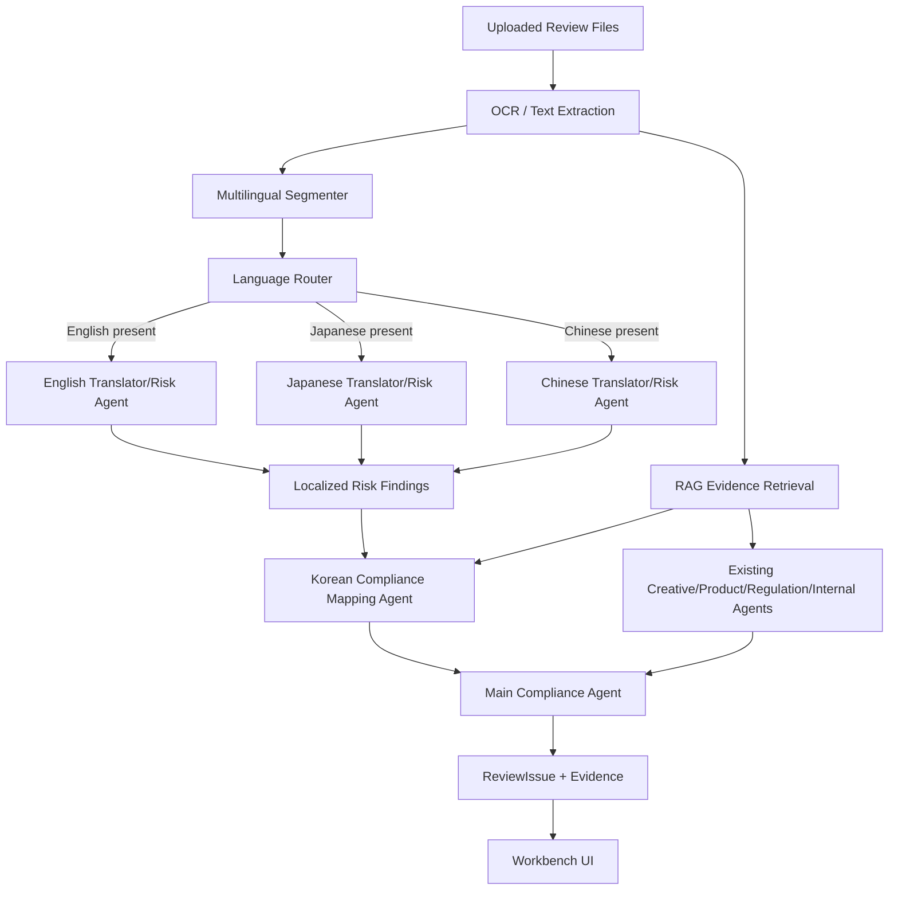
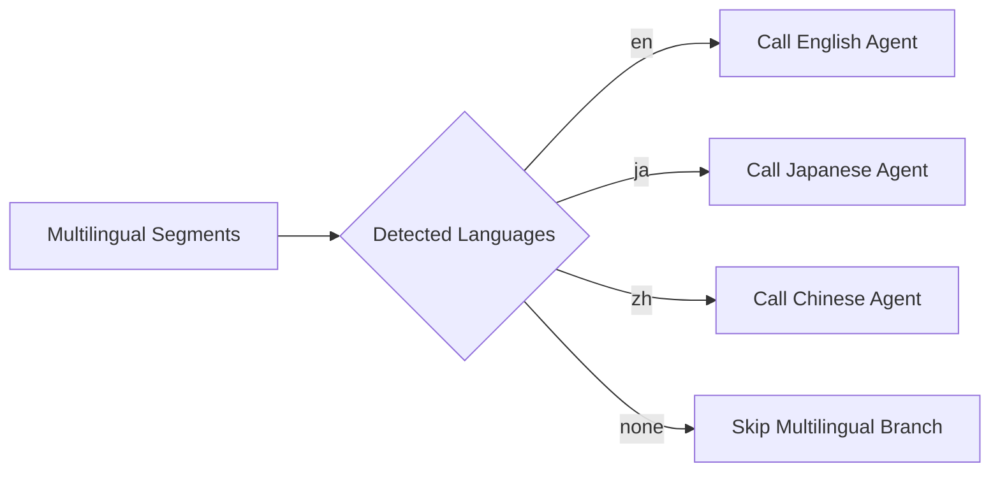

# Multilingual Translator Risk Team Design

## Goal

Add multilingual financial advertising review to FinProof without replacing the existing Korean compliance workflow.

The first supported languages are English, Japanese, and Chinese at the same product level. The feature detects foreign-language copy in uploaded review materials, routes each language to a language-specific translator/risk sub-agent, preserves original-language nuance, then maps the finding back to Korean financial advertising compliance categories.

## Current Baseline

The current codebase already has the right extension points:

- `src/server/analysis/review-analysis-pipeline.ts` owns the OCR/RAG/sub-agent analysis flow.
- `src/server/analysis/review-subagents.ts` already orchestrates multiple domain agents and a main compliance agent.
- `src/server/ai/model-router.ts` routes task types to model tiers.
- `AnalysisJob.artifacts` stores structured analysis JSON.
- `AgentFinding.outputSnapshot` can preserve agent-specific structured output.
- `ReviewIssue.agentFindingId` can link a final issue back to the finding that produced it.
- `KnowledgeDocument` and `EvidenceChunk` already support approved Korean law/internal-policy RAG evidence.

The design keeps these boundaries and adds a multilingual branch inside the existing analysis flow.

## Non-Goals

This slice does not implement:

- Overseas jurisdiction-specific compliance review.
- Separate legal rules for the US, Japan, China, or other countries.
- Full UI localization of FinProof itself.
- Human translation workflow or certified translation.
- New external regulatory source ingestion.
- A new microservice or separate queue system.

The compliance standard remains Korean financial advertising review. Language-specific agents only improve original-language understanding and risk detection.

## Target Architecture



The key property is conditional execution. FinProof does not call all language agents on every analysis. The language router calls only agents needed for detected language segments.



## Processing Flow

1. OCR extracts text and available file/page/bounding-box metadata.
2. `MultilingualSegmenter` splits extracted text into reviewable segments.
3. `LanguageRouter` groups segments by `en`, `ja`, and `zh`.
4. Each matching language group is sent to its translator/risk agent.
5. Each language agent returns literal translation, compliance meaning, original-language risk signals, risk hint, and original-language correction proposal.
6. `KoreanComplianceMappingAgent` maps localized findings to Korean compliance issue types and evidence queries.
7. Existing RAG retrieval remains the source of Korean law/internal-policy/product evidence.
8. `MainComplianceAgent` merges multilingual findings with existing creative/product/regulation/internal-policy findings.
9. Final `ReviewIssue` records keep `targetText` as the original foreign-language copy and link to the underlying `AgentFinding`.
10. The workbench displays original text, Korean meaning, risk signals, Korean compliance mapping, evidence, and suggested original-language copy.

## New Analysis Types

Add these domain types under the analysis layer. They are persisted first through `AnalysisJob.artifacts` and `AgentFinding.outputSnapshot`.

```ts
type SupportedReviewLanguage = "en" | "ja" | "zh";

type MultilingualSegment = {
  id: string;
  language: SupportedReviewLanguage;
  originalText: string;
  normalizedText: string;
  sourceFileId?: string;
  page?: number;
  bbox?: [number, number, number, number];
  confidence: number;
};

type LocalizedRiskFinding = {
  segmentId: string;
  language: SupportedReviewLanguage;
  originalText: string;
  literalTranslation: string;
  complianceMeaning: string;
  riskCategory: "expression_risk" | "compliance_risk" | "both";
  riskSignals: string[];
  riskLevelHint: "info" | "caution" | "high" | "reject_recommended";
  suggestedCopyOriginalLanguage: string;
  suggestedCopyKoreanMeaning: string;
  confidence: number;
};

type KoreanComplianceMapping = {
  localizedFindingId: string;
  issueType: string;
  koreanComplianceCategory: string;
  koreanComplianceReason: string;
  evidenceQuery: string;
  suggestedAction: "approve" | "change_request" | "reject" | "hold";
};
```

The first implementation should avoid a new Prisma model. If UI/API needs become broader in a future slice, these structures can graduate to a first-class model.

## Language Segmenter

`MultilingualSegmenter` should be deterministic first:

- Split OCR text by line and sentence-like punctuation.
- Ignore pure Korean segments.
- Detect English by Latin alphabet ratio and common financial-ad terms.
- Detect Japanese by Hiragana/Katakana ranges plus Kanji context.
- Detect Chinese by Han-character segments without Japanese kana.
- Keep mixed segments when a line combines Korean and foreign copy.

The segmenter can use model fallback only when language confidence is ambiguous. Local tests should cover deterministic behavior without API keys.

## Language Agents

Add three same-level sub-agents:

- `english_translator_risk`
- `japanese_translator_risk`
- `chinese_translator_risk`

Each agent receives only segments in its language plus minimal review context:

- Review title, product type, channel type.
- Segment text, source file/page/bbox if available.
- Nearby OCR text if available.
- Output schema for `LocalizedRiskFinding[]`.

Each agent must:

- Preserve original text exactly.
- Explain literal Korean meaning.
- Explain compliance-relevant meaning, not just dictionary translation.
- Identify original-language risk signals.
- Return no finding when the segment is informational and not risky.
- Suggest safer copy in the original language and Korean meaning.

Example output:

```json
{
  "segmentId": "seg-en-001",
  "language": "en",
  "originalText": "Guaranteed approval in 3 minutes",
  "literalTranslation": "3분 안에 승인 보장",
  "complianceMeaning": "대출 승인이 심사와 무관하게 확정되는 것처럼 해석될 수 있음",
  "riskCategory": "both",
  "riskSignals": ["approval_guarantee", "instant_approval"],
  "riskLevelHint": "reject_recommended",
  "suggestedCopyOriginalLanguage": "Apply in 3 minutes. Approval is subject to credit review.",
  "suggestedCopyKoreanMeaning": "3분 신청 가능. 승인은 신용심사 결과에 따라 달라질 수 있음.",
  "confidence": 0.91
}
```

## Korean Compliance Mapping Agent

Add `korean_compliance_mapping` after language agents. It converts localized findings into Korean compliance categories.

Responsibilities:

- Map original-language risk signals to existing issue patterns.
- Build evidence queries that work against approved Korean law/internal-policy/product RAG.
- Avoid making foreign-law claims.
- Preserve the original-language copy as `targetText`.
- Recommend `suggestedAction` based on Korean compliance severity.

Example mappings:

- `approval_guarantee` -> `MULTILINGUAL_APPROVAL_GUARANTEE`
- `lowest_rate` -> `MULTILINGUAL_RATE_CONDITION_MISSING`
- `no_screening` -> `MULTILINGUAL_SCREENING_OMISSION`
- `no_hidden_fees` -> `MULTILINGUAL_FEE_DISCLOSURE_RISK`
- `universal_eligibility` -> `MULTILINGUAL_ELIGIBILITY_OVERSTATEMENT`

## ReviewIssue Projection

The final issue should fit the existing `ReviewIssue` shape.

```ts
{
  issueType: "MULTILINGUAL_APPROVAL_GUARANTEE",
  riskLevel: "reject_recommended",
  title: "영문 승인 보장 오인 표현",
  targetText: "Guaranteed approval in 3 minutes",
  sourceAgents: [
    "english_translator_risk",
    "korean_compliance_mapping",
    "internal_policy"
  ],
  description:
    "영어 원문은 대출 승인이 심사와 무관하게 확정되는 것처럼 해석될 수 있습니다. 국내 대출광고 기준상 승인 보장 오인 표현으로 분류됩니다.",
  suggestedCopy:
    "Apply in 3 minutes. Approval is subject to credit review."
}
```

The associated `AgentFinding.outputSnapshot` should include the full localized finding and mapping object so the UI can show structured detail without overloading `description`.

## Model Routing

Add these tasks to `ModelRouteTask`:

- `english_translator_risk`
- `japanese_translator_risk`
- `chinese_translator_risk`
- `korean_compliance_mapping`

Routing policy:

- Normal language findings use `default_text`.
- High-risk hints, ambiguous translation, or low confidence escalate to `escalation_text`.
- Korean compliance mapping uses `escalation_text` by default because it affects final issue severity.
- If source OCR confidence is low, include `lowOcrConfidence` in route context.

## RAG Integration

RAG remains Korean evidence-first.

Evidence queries should include:

- Original-language text.
- Literal Korean translation.
- Compliance meaning.
- Product type and review context.
- Risk signal labels.

This lets the retriever match approved internal policies such as prohibited approval-guarantee language, rate condition disclosure, or fee disclosure rules.

## UI Integration

Add a multilingual context block to the issue detail area when the issue has a linked localized finding.

The block should show:

- Original expression.
- Korean literal translation.
- Compliance meaning.
- Risk signals.
- Korean compliance mapping.
- Original-language suggested copy.
- Korean meaning of suggested copy.

Do not add a new top-level page. The workbench should keep the current issue-list, creative viewer, evidence tab, and opinion workflow.

## Error Handling

- If language detection fails, skip multilingual branch and continue existing Korean analysis.
- If one language agent fails, record a failed agent run and continue other languages.
- If translation confidence is low, create a caution-level "원문 검토 필요" finding instead of a definitive violation.
- If Korean compliance mapping fails, keep the localized finding in artifacts but do not create a high-risk issue from it.
- If no approved Korean evidence is found, the issue should say evidence is insufficient and request reviewer confirmation.

## Testing

Unit tests:

- Segmenter detects English, Japanese, and Chinese segments.
- Language router calls only agents for languages present.
- Agent output parser rejects malformed JSON and preserves fallback behavior.
- Korean mapping creates expected issue types from risk signals.
- `targetText` remains original foreign-language copy.

Integration tests:

- English-only review creates an English multilingual issue.
- Japanese-only review creates a Japanese multilingual issue.
- Chinese-only review creates a Chinese multilingual issue.
- Mixed English/Japanese/Chinese review calls all three language agents and merges findings.
- Agent failure in one language does not fail the whole analysis.

UI tests:

- Issue detail shows original expression and Korean meaning.
- Evidence tab still shows Korean RAG evidence.
- Opinion draft uses original-language suggested copy where relevant.

## Acceptance Criteria

- English, Japanese, and Chinese are supported at equal feature level.
- Only detected-language agents are called.
- Existing Korean-only reviews behave unchanged.
- Multilingual findings are traceable through `AnalysisJob.artifacts` and `AgentFinding.outputSnapshot`.
- Final issues preserve the original foreign-language risky copy.
- Korean compliance evidence remains tied to approved knowledge documents.
- Reviewer can understand why the original-language expression is risky without reading raw agent output.
